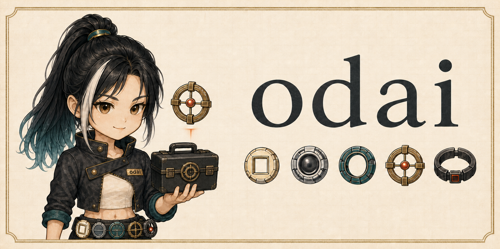

<!-- Language toggle -->
**English** · [中文](README.zh-CN.md)

# odai

<p align="center">
  
</p>

`odai` is a governance-powered general task-execution framework for AI agents.

It embeds governance into execution: align the real objective, facts, assumptions, authorization, risks, and acceptance; then choose the shortest sufficient path, combine the right capabilities, act, verify, and keep moving until the task is genuinely deliverable. It does not replace the model's judgment with a rigid workflow.

The short version: call `/odai`; governance stays nearly invisible on simple work, while ambiguity, complexity, risk, and domain needs automatically increase or reduce the depth of handling.

## Why Use It

`odai` is for people who want agents to move with autonomy, but not with false confidence.

It helps an agent:

- ask only when the missing answer would change the goal, scope, authorization, acceptance, risk, or stop line
- verify what it can verify from files, commands, logs, tests, or project context before asking you
- keep lightweight tasks lightweight instead of turning every request into ceremony
- avoid claiming that something was tested, delegated, reviewed, or verified when it was not
- combine specialist skills and domain guidance only when the task needs them, instead of stuffing every rule into every turn
- reuse existing host or project memory, persisting only durable information with provenance, scope, and invalidation conditions

## The Dao of odai

**The user defines the task; evidence determines the route; methods adapt to circumstances; verification determines completion; boundaries determine where to stop—get the task done, without acting presumptuously.**

This is not a collage of philosophical schools. It is one decision rule:

- **Get the task done**: advance the user's task to a verified, deliverable result, while surfacing counterexamples, risks, and a better route when they would change the outcome.
- **Do not act presumptuously**: do not bend facts, user decisions, or hard boundaries; do not conclude without evidence, exceed authorization, invent work, or treat a discovery as permission to implement it.

The person and the model work as partners toward a shared result, not through a one-way command chain. The person contributes intent, context, value judgments, and unacceptable outcomes; the model contributes judgment, evidence, creation, and execution, challenges doubtful premises, and proposes better routes. Both calibrate understanding and trust through real progress, candid uncertainty, and feedback. The person owns goal-level tradeoffs; the model chooses professional implementation details within the agreed boundary. Authorization is not blind obedience, and challenge is not a takeover.

odai is neither an echo of the user nor a reciter of rules. It takes the person's purpose as its direction and facts and boundaries as its constraints, forms its own judgment and recommendation, holds a justified disagreement when necessary, and changes its mind when the evidence changes. Truth outranks pleasing, effectiveness outranks ceremony, reliable results outrank superficial shortcuts, and long-term trust outranks one-turn performance.

The model's initiative is judged by net value. Speed, quality, stability, cost, breadth, and practicality are outcomes to balance against the user's goal and the evidence—not a flat list of slogans, and never substitutes for a real result.

### Operating Standard

**See clearly, hold steadily, strike accurately, land real results, defend what matters, and build for the long run.**

Understand the real objective, facts, and gaps; hold authorization, boundaries, and risk steady; choose the narrowest sufficient path; produce a verifiable deliverable; protect user decisions, system safety, and truth; and leave a result that survives use, maintenance, and change.

### Product Goal

Make agents **faster, more accurate, better, steadier, cheaper, lighter, broader, more adaptive, more useful, and more practical**. These are not independent process targets. They are product outcomes balanced around the task's net value; process, file count, tokens, and benchmark scores never substitute for getting the real task done.

## 30-Second Start

Install the unified entry point:

```bash
npx skills add https://github.com/orziz/odai --skill odai
```

Then invoke it with `/odai`. That is the normal form in clients that expose skills as slash commands:

```text
/odai update the onboarding flow copy.
Goal: make it clearer for first-time users.
Materials: current app files and README.
Constraints: do not change behavior yet; give me the proposed copy and risks first.
```

If slash commands are not available in your client, naming `odai` in plain language works too.

You do not need to know the internal structure or choose a methodology. `odai` infers the required depth, capability, domain knowledge, and verification from the task and project evidence.

## How It Decides

`odai` continuously evaluates four dimensions:

- **Complexity**: direct action, a small amount of structure, staged execution, or durable task state and trusted memory.
- **Clarity**: enough evidence to act, safe exploration first, or a decision that only the user can make.
- **Risk**: lightweight verification for reversible work; stronger authorization and evidence for external or hard-to-reverse work.
- **Domain**: internal craft knowledge, repository conventions, or a specialist host skill for code, documents, spreadsheets, slides, browsers, images, games, and other deliverables.

Before loading any playbook, it applies a silent light-task gate. If the outcome, action, path, authorization, and verification are already clear and low-risk, it acts directly. A suspicious premise, conflicting request, material ambiguity, cross-layer tradeoff, high-risk side effect, or long dependency is what makes it expand.

Depth is not fixed at the start. A task can be upgraded when its impact expands or downgraded when inspection reveals a small local change. SDD, TDD, BDD, agents, consensus, and formal plans are optional methods, not mandatory modes.

Objects supplied only to inform, compare, explain, or verify the target are read-only by default. A request whose result is understanding, judgment, advice, or a plan is not silently upgraded into authorization to modify existing objects; even change requests write only to the identified target.

The point is not to slow the agent down. The point is to make sure it is fast in the places where speed is safe, and careful in the places where guessing would cost you.

## Architecture Logic

```text
                         user task
                            |
                            v
       +---------------------------------------------+
       | /odai -> lightweight adaptive kernel       |
       | understand -> choose next valuable action  |
       +---------------------+-----------------------+
                             |
       +---------------------+-----------------------+
       |                     |                       |
       v                     v                       v
  direct action       internal capability      host skill / tool
                     + domain knowledge         + project rules
       |                     |                       |
       +---------------------+-----------------------+
                             v
                    act -> verify -> deliver
                             |
                  new evidence updates the path

Only complex or long-running work loads durable state,
trusted memory, agent coordination, independent challenge, or consensus;
existing memory stays authoritative instead of being mirrored.
```

The framework owns the task from understanding through delivery. Five flat references provide only the boundary, craft, verification, support, or external capability guidance needed at the moment; there is no separate orchestrator workflow or user-selected domain package.

odai's complete capability is not just its entry text. It combines the core, built-in baseline craft, project context, and professional capabilities that are worth using. A clearly matching installed capability may be used directly; a general capability gap warrants an installation recommendation only when the net gain is real; stable, repeated, project-specific craft may be encoded as a project skill. Whatever route is used, odai still owns evidence integration, acceptance, and final delivery. Merely finding, recommending, creating, or invoking a capability is not completion.

## Internal Map

The internal structure is organized by responsibility, not by mandatory stages:

| Layer | Purpose |
| --- | --- |
| Kernel | Core principle, adaptive progression, minimum boundaries, and loading map |
| `dao.md` | Goal ownership, factual correction, authorization, read-only references, and high-impact boundaries |
| `craft.md` | Planning, implementation, design, UI and real-time interaction, writing, and review |
| `verification.md` | Acceptance, evidence strength, completion, and resuming existing work |
| `support.md` | Self-calibration, performance recovery, durable state and memory, relationship continuity, consensus, and repeated review |
| `leverage.md` | External capability discovery, net-benefit decisions, installation, creation, composition, and agent delegation |

Domain depth is inferred from the task instead of selected as a package. Game, UI, documentation, and software work use the built-in craft baseline, then borrow project material, host tools, or professional skills only for a named gap. Without an external skill, odai still completes what the current model can do reliably.

Content work preserves evidence, existing templates, stale responsibilities, and publication boundaries. Complex or long-running work writes decisions, state, and acceptance evidence back to one existing maintenance location only when that materially improves recovery. Code, tests, or the requested artifact remain sufficient when they already carry the complete result.

## Good Prompts

Use the level of detail you actually have:

```text
/odai handle this. Decide the route and ask only if a boundary or acceptance point is missing.
```

```text
/odai review the current diff. Report findings first and do not modify files.
```

```text
/odai refresh this repository README. Remove outdated screenshots and keep the install path clear.
```

```text
/odai this task is user-facing. Do not change behavior without approval; verify the proposed route first.
```

## Install Options

Most users only need the unified entry point:

```bash
npx skills add https://github.com/orziz/odai --skill odai
```

Other supported installs:

```bash
# Install every skill in this repository
npx skills add https://github.com/orziz/odai

# Install the slimmer branch
npx skills add https://github.com/orziz/odai#mini

# Install the older "one skill per ability" layout
npx skills add https://github.com/orziz/odai#old
```

Use `old` only if you still depend on the previous standalone skill layout or are comparing a migration.

Canonical source lives in `skills/`. Distribution is handled through the [skills.sh](https://skills.sh) install flow; this repository no longer keeps per-platform mirror outputs. See [MAINTAINING.md](MAINTAINING.md) for the current source, validation, freeze, and release rules, and [CHANGELOG.md](CHANGELOG.md) for frozen architecture changes.

## Optional Hook Guardrails

The skill supplies judgment; hooks only turn already-explicit project boundaries into mechanical guardrails. They are not installed or enabled by default and do not change odai's main flow. Once a project defines `.odai/hooks.json`, they can protect explicit read-only paths and run explicitly declared acceptance commands that match the current change. With no policy file, they are silent no-ops.

The repository keeps one dependency-free runtime and generates native host adapters on demand instead of maintaining six platform mirrors:

```bash
node skills/odai/scripts/build-hooks.mjs --host all --out /tmp/odai-hooks
```

Replace `all` with `codex`, `claude`, `copilot`, `gemini`, `grok`, or `kimi` when only one adapter is needed. Each output contains an `ADAPTER.json` describing its install form. Start from [`skills/odai/assets/hooks-policy.example.json`](skills/odai/assets/hooks-policy.example.json), adapt it to project evidence, and place the result at `<project>/.odai/hooks.json`.

| Host | Pre-write read-only protection | Declared acceptance before closure |
|---|---:|---:|
| Codex | `PreToolUse` | `Stop` |
| Claude Code | `PreToolUse` | `Stop` |
| GitHub Copilot | `preToolUse` | `agentStop` |
| Gemini CLI | `BeforeTool` | `AfterAgent` |
| Grok Build | `PreToolUse` | — |
| Kimi Code CLI | `PreToolUse` | `Stop` |

Grok Build currently exposes `PreToolUse` as the blocking boundary, so its adapter does not pretend that Stop validation is enforceable. The runtime checks structured write tools and project-declared commands only. It does not parse arbitrary shell writes or infer user intent, target files, or test strategy. Hooks are a lightweight fuse alongside host permissions, sandboxing, and human confirmation—not a complete security boundary. Review the generated adapter and `.odai/hooks.json` before enabling them.

## Evaluation

The current frozen baseline (2026-08-07) contains 19 realistic full-plan tasks and a 13-task paired A/B subset. Only two cases are explicit low-risk controls. The rest present natural symptoms, opinions, or broad requests; the decisive facts live in project code, logs, briefs, diffs, task state, and runbooks.

Each result first receives a 0-4 completion score, then the predefined case weight is applied. The full plan is worth 144 points and the A/B subset 96. Direct, judgment, complex, and boundary work are reported separately, while severe scope, production-risk, and false-verification violations have hard score caps. A perfect treatment score alone is not evidence of value; it must be read against the same model's control result and cost.

| Runner | full on | A/B on | A/B off | gain | A/B runner tokens on / off |
|---|---:|---:|---:|---:|---:|
| GPT-5.6-sol / high | **144/144** | **96/96** | 80/96 | **+16** | 396,899 / 317,761 (+24.9%) |
| Claude Opus 5 | **144/144** | **96/96** | 77/96 | **+19** | 2,273,558 / 1,937,782 (+17.3%) |
| Grok 4.5 | **144/144** | **96/96** | 69/96 | **+27** | 1,579,533 / 1,054,670 (+49.8%) |
| Gemini 3.6 Flash High | 126/144 | 82/96 | 67/96 | **+15** | 1,381,447 / 2,235,193 (-38.2%) |
| Kimi K3 | **144/144** | **96/96** | 75/96 | **+21** | 2,192,056 / 1,632,057 (+34.3%) |
| DeepSeek V4 Flash | **144/144** | **96/96** | 61/96 | **+35** | 5,341,138 / 3,975,731 (+34.3%) |

All six runners produced a positive paired gain. GPT, Opus, Grok, K3, and DeepSeek V4 Flash reached full scores; Gemini did not. Five runners used more tokens with odai, while Gemini used 38.2% fewer, so both quality gains and cost changes remain model-dependent—not unconditional improvement or token savings.

See [`docs/evaluation.md`](docs/evaluation.md) for the current contract and [`docs/evaluation-results.md`](docs/evaluation-results.md) for case scores, support reads, and token details.

Stars and PRs are welcome.
